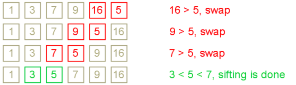
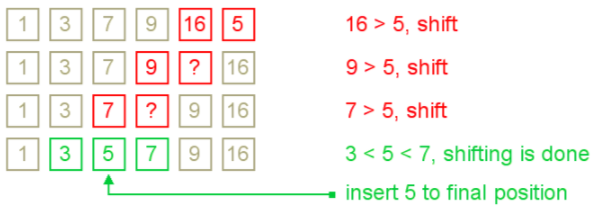

#插入排序
插入排序是一个时间复杂度$$$\mathit{O}\left ( n^{^{2}} \right )$$$的排序算法。但与很多二次复杂度的排序算法不同，在实际中其被用来做数据的小范围的排序。例如其被用在快速排序中。在生活中，人们用同样的方法来对手牌进行排序。
##算法
插入排序在某种程度上与选择排序有着相似性。数组被划分成两部分——<font color=green>已排序部分（sorted one）</font>和<font color=red>未排序部分（unsorted one）</font>。开始时候，排序部分只包含了数组的第一个元素，未排序部分则包含剩下部分。在每一步中，算法提出未排序部分的第一个元素，将这个元素插入到左边已排序部分的合适位置。当未排序部分没有元素的时候，算法停止。插入算法的步骤大致如下：

|<font color=green>Sorted partial result</font>      |       | <font color=red>Unsorted data</font>|
|---------------------------|-------|-----------------|
| <font color=green>elements<=X and elements>X</font>|   X   | <font color=red>~~~</font>|

将X插入到排序部分之后变成：

|<font color=green>Sorted partial result</font>|<font color=red>Unsorted data</font>|
|--------------------------|-------------------|
|<font color=green>elements<=X + X + elements>x</font>|<font color=red>~~~</font>|

这个算法的[思想](https://en.wikipedia.org/wiki/Insertion_sort)可以通过下面这个例子展示出来：  

插入算法排序{7， -5，  2， 16， 4}


|step|1|2|3|4|5| info|
|-|-|-|-|-|-|----------------|
|1|<font color=red>7</font>|<font color=red>-5</font>|<font color=red>2</font>|<font color=red>16</font>|<font color=red>4</font>|<font color=red>unsorted</font>|
|2|<font color=green>7</fon	t>|<font color=red>-5</font>|2|16|4|<font color=red>选中-5为插入元素</font>|
|3|<font color=red>?|<font color=green>7|2|16|4|<font color=red>7>-5|
|4|<font color=green>-5|<font color=green>7|2|16|4|插入到合适的位置|
|5|<font color=green>-5|<font color=green>7|<font color=red>2|16|4|插入2|
|6|<font color=green>-5|<font color=green>2|<font color=green>7|16|4||
|7|<font color=green>-5|<font color=green>2|<font color=green>7|<font color=red>16|4|插入16|
|8|<font color=green>-5|<font color=green>2|<font color=green>7|<font color=green>16|4||
|9|<font color=green>-5|<font color=green>2|<font color=green>7|<font color=green>16|<font color=red>4|插入4|
|10|<font color=green>-5|<font color=green>2|<font color=green>4|<font color=green>7|<font color=green>16|完成|

##插入的思想
这个算法的主要操作就是插入。主要的任务是将一个元素插入到一个已经排序好的数组中。  
下面我们将看看这个算法的一些变化：  


###通过交换（swap）“下降”元素  
The simplest way to insert next element into the sorted part is to sift it down, until it occupies correct position.   
-----------
初始状态时，待排序元素放在已排序部分的右边。（如下图）在每步中，算法将会比较待排序元素和其其前一个元素，如果它们是倒序的就将它们两个交换。  
下图为一个例子：
  

这种方法是通过多次将被下降的元素写入到临时位置中。下一个改进的算法将消除一些不必要的写入操作。  
  
我们将改进前一个算法，这个算法将使被下降的元素在最后正确的地方写入。
  

###利用二分查找
通过二分查找（binary search algorithm）的方法找到序列中插入的合适位置。这个插入排序的变体叫做二分插入排序。在找到合适的插入位置之后，算法将移动序列的部分元素，再将待排序元素插入。
这样的方式虽然使得在两数比较次数变少，但是总体平均复杂度还是$$$\mathit{O}\left ( n^{^{2}} \right )$$$。因为插入排序是用在小数据集上，所以从实际出发，这样方式的提升是不重要的。  
###复杂度分析
不管插入的方法怎样，插入排序的全局平均复杂度都是$$$\mathit{O}\left ( n^{^{2}} \right )$$$，平均写入是$$$\mathit{O}\left ( n^{^{2}} \right )$$$。但比较次数取决于插入的算法，
当用的是shifting或是swap方法的时候，比较次数为$$$\mathit{O}\left ( n^{^{2}} \right )$$$。当时二分插入排序的时候，比较的次数为$$$nlog(n)$$$。  

插入排序被用在很小的数据集上（一般是8到12个元素），在实际使用中，插入排序表现的比很多的平方排序算法要好，比如选择排序和冒泡排序。

  
```C
void insertionSort(int arr[], int length){
	int i,j,temp;
	for(i = 1, i < length, ++i){
		j = i;
		while(j > 0  && a[j-1] > a[j]){
			temp = a[j];
			a[j] = a[j-1];
			a[j-1] = temp;
			j--;
		}
	}
}
```